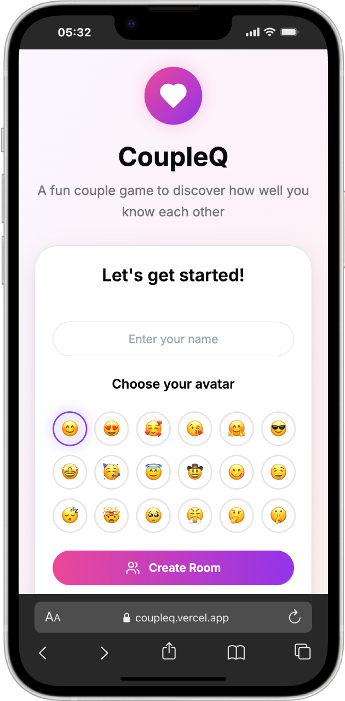
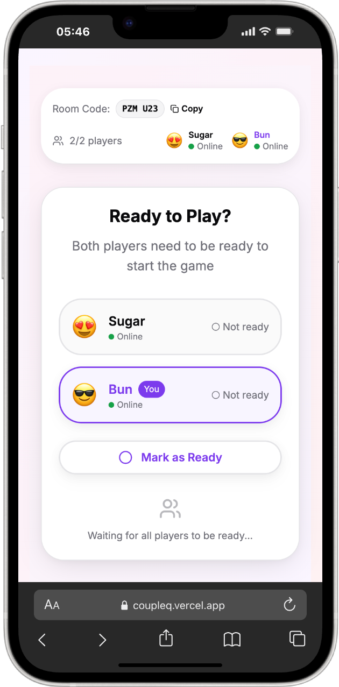
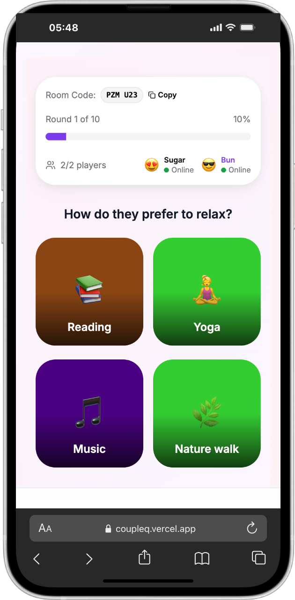
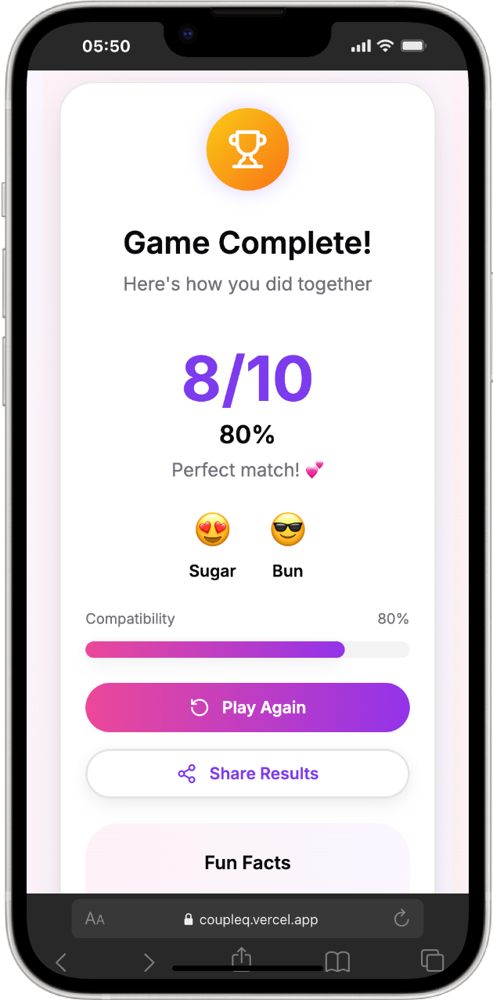

# 💕 CoupleQ — Playful Compatibility Game

> **CoupleQ** is a fun, real-time **2-player couple game** built with **Next.js + Convex**.  
> Discover your compatibility through **beautiful image-based questions** and laugh along the way!

---

## 🎨 Branding & Logo

{ width=300 }  
_CoupleQ branding and logo preview_

---

## ✨ Features That Shine

- 🎮 **Real-time multiplayer** — Play instantly with your partner
- 📱 **Mobile-first design** — TikTok-style vertical layout
- 🎨 **Beautiful UI** — Smooth **Framer Motion** animations
- 💕 **Compatibility scoring** — See your couple score (0–10)
- 🖼️ **Image-based questions** — Fun, visual choices every round
- ⚡ **Live updates** — Presence + synced game states
- 🎯 **Smart matching** — Advanced compatibility algorithm
- 🎪 **Expandable decks** — Multiple themed question sets
- 👥 **Emoji avatars** — Pick from 18 quirky emoji characters
- 🔄 **Rematch mode** — Beat your best score anytime

---

## 🛠️ Tech Stack

- **Frontend** → Next.js 14, TypeScript, TailwindCSS, Framer Motion
- **Backend** → Convex (real-time DB + functions)
- **State Management** → Zustand
- **UI Components** → shadcn/ui + Radix primitives
- **Styling** → Tailwind + design tokens
- **Icons** → Lucide React
- **Animations** → Framer Motion transitions

---

## 🚀 Quick Start

### ✅ Prerequisites

- Node.js 18+
- npm / pnpm
- Free Convex account → [convex.dev](https://convex.dev)

### ⚡ Installation

```bash
git clone <repository-url>
cd coupleQ
npm install
# or
pnpm install
```

### ⚙️ Setup Convex

```bash
npx convex dev
```

This will:

- Create a project
- Deploy DB + functions
- Generate `.env.local` vars

```bash
echo "NEXT_PUBLIC_CONVEX_URL=your_convex_url_here" > .env.local
```

### ▶️ Run locally

```bash
npm run dev
# or
pnpm dev
```

Open 👉 [http://localhost:3000](http://localhost:3000)

{ width=400 }  
_Development setup preview_

---

## 🎮 Gameplay Walkthrough

### 1️⃣ Create or Join a Room

{ width=350 }  
_Landing page with avatar picker_

- Pick your **name + emoji avatar**
- Create room or enter 6-character code (e.g., `ABC123`)

---

### 2️⃣ Lobby Wait

{ width=350 }  
_Lobby screen showing room code + waiting state_

- Share code with partner
- Both mark **Ready** → Start game
- See partner’s online presence

---

### 3️⃣ Answer Questions

{ width=350 }  
_Question screen with image options_

- Play **10 rounds** of visual Qs
- Choose from **4 SVG options** each round
- Lock answers → Reveal together 🎉

---

### 4️⃣ Results & Scoring

{ width=350 }  
_Results screen with compatibility score_

- Get your **compatibility score** (0–10)
- Fun percentage + compatibility message
- Rematch & share results 💌

---

## 📁 Project Layout

```
coupleQ/
├── app/            # Next.js App Router
├── components/     # UI components
├── convex/         # Convex backend
├── data/           # Decks + question data
├── lib/            # Utilities + scoring
├── stores/         # Zustand state
├── public/         # Static assets
└── scripts/        # Optimization scripts
```

---

## 🎯 Game Flow

1. **Lobby Phase** → join, ready, start
2. **Game Phase** → 10 rounds: pick → lock → reveal
3. **Results Phase** → score, message, rematch

---

## 🎨 Customization

- Add new decks via JSON + SVGs
- Update registry in `data/decks/index.ts`
- Style via `tailwind.config.ts` + globals.css
- Animations handled by **Framer Motion**

---

## 🚀 Deployment

- **Frontend** → Vercel auto-deploy
- **Backend** → `npx convex deploy`

---

## 🤝 Contributing

- Fork → Branch → PR
- Follow **TypeScript + Tailwind standards**
- Add tests + screenshots for new features

---

## 📄 License

MIT — [LICENSE](LICENSE)

---

## 🎉 Acknowledgments

Built with ❤️ for couples everywhere.  
Inspired by TikTok-style UIs.  
Powered by **Convex**.

---

👉 **Ready to test your compatibility?**  
Fire up **CoupleQ** and start playing today! 🎮💕
